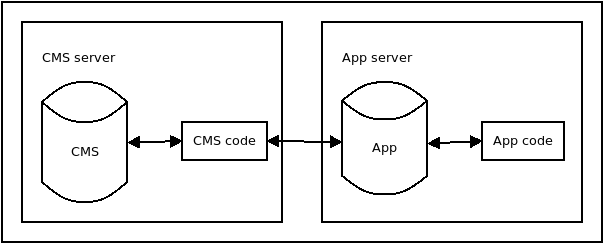

# Technical overview - Backend

The Lifted App and CMS, which we will refer to collectively as "the system",
are web apps which can be accessed through a modern web browser, both on
desktop or mobile devices. Like most web apps, the system is split into
frontend and backend code and subsystems.

## Architecture

Early in the development of the system, it was found that pre-packaged software
solutions which can meet LEC's needs do not exist. As such, the App and CMS
were tailor-made.

<a href="./images/architecture.png" target="_blank">
    
</a>

The backend runs on two Amazon EC2 server instances and uses Amazon CloudFront
as a content delivery network (CDN). Amazon Route 53 manages the Domain Name
Service (DNS) records of the `lifted.sg` domain, registered under [Speednames
Asia](https://speednames.asia/). All application logs (except for those of the
scraper) are fed to Amazon CloudWatch.

<a href="./images/aws_services.png" target="_blank">
    
</a>

The app and CMS servers run Docker (v17) containers orchestrated by Docker
Compose (v1.17.1), as well as one non-containerised Postgres (v9.5) instance
per server.

The EC2 instances use a security group as a firewall. It restricts access to
each databases to the IP addresses of each server, and opens the necessary
ports for database, HTTP and SSH access. In effect, each databases can only be
accessed from `localhost` or from the other server, and not externally. 
Furthermore, all non-whitelisted ports are blocked.

The system architecture is separated in this way to improve security and
reliability. As the CMS is meant for internal use only, and the App for public
use, keeping the CMS data separate prevents an entire class of bugs which might
expose it through potentially flawed App code. Moreover, having the CMS
separate allows it to be upgraded without affecting the App.

Docker was chosen because it greatly reduces deployment time and eliminates
many server environment inconsistencies. The goal was to make deployment as
hassle-free as possible due to the large number and complex relationships
between code dependencies in both the frontend and backend.

The backend web server runs Django because it is reliable, elegant, and
battle-tested. It provides very useful features, especially a powerful database
ORM, right out of the box.

### Ports used

|Number|Service|Notes|
|---|---|---|
|80|HTTP||
|443|SSL/TLS||
|2233|SSH|It is a best practice to not use port 22 for SSH|
|5544|Postgres|Restricted to traffic between the App and CMS servers|
|9001|HTTP|For the CMS|
## Source code layout

The source code is managed via a single Git repository, and backed up in both
Github and AWS CodeCommit. The source code is organised in the following
manner. Deployment-related code is confined to the `docker` and `scripts`
directories, while source code for the system mainly resides in `src`. Note
that some directories, such as those for Django templates or migrations are
excluded below as it is only a general overview or the organisation of the
code.

```
admin_server
    |- scraper/
docker
    |- admin_server
        |- Docker, Docker Compose, and configuration files
    |- app_server
        |- Ditto
docs (this Gitbook)
license_extractor (see below)
scripts (deployment scripts)
    |- admin_server
        | dev
        | prod
    |- app_server
        | dev
        | prod
src
    |- lib (TODO: shift to a more suitable location
    |- lm (the Django project directory)
        |- app
            |- frontend
        |- cms
            |- frontend
        |- static
```

## Organisation of Docker containers

The Docker containers run Alpine Linux to reduce image size, minimise attack
surfaces, and simplify development. The small image size benefit can be most
acutely experienced when deploying the system, a process that involves using
`docker push` to copy Docker images to the remote servers. If the images were
to use Ubuntu or even Debian images, this process would take up more than twice
the amount of time and bandwidth.

On the CMS server, Docker Compose orchestrates the following containers via
`docker/admin_server/docker-compose.prod.yml`:

- **admin_cms**
    - Defined in `docker/admin_server/cms.prod.dockerfile`.
    - Runs Gunicorn and Nginx to serve the Django project located at `src/lm`.
      More information about this Django project can be found below.
    - Configuration files:
        - `docker/admin_server/nginx.conf`

- **admin_scrapyd**
    - Defined in `docker/admin_server/scrapyd.prod.dockerfile`.
    - Using `supervisord`, the container runs `scrapyd`, which is in turn
      configured to control a Scrapy project whose code is located in
      `admin_server/scraper/`.
    - `supervisord` is necessary in order to schedule scrape jobs and run the
      `scrapyd` daemon in the background. However, note that the scrape job
      scheduler at `scraper_scheduler.py` is disabled as the Lifted team prefers to
      launch the jobs manually.
    - Configuration files:
        - `docker/admin_server/scrapyd.conf`
        - `docker/admin_server/supervisor_scrapyd.ini`

- **admin_db**
    - Defined in `docker/admin_server/db.prod.dockerfile`.
    - Only useful when running the CMS on a machine that does not have a local
      copy of Postgres, such as a development machine. On a production machine,
      do not configure `admin_cms` to connect to this container, and use a
      non-Dockerised Postgres database instead. If you do this, `admin_db` can
      be left alone.
    - Configuration files:
        - `./docker/app_server/db.init.sql`: creates a database called
          `admin` and grants access privileges to the `postgres` user.

On the App server, the following containers, orchestrated via
`docker/app_server/docker-compose.prod.yml`, are:

- **liftedmobile**
    - Defined in `docker/app_server/liftedmobile.prod.dockerfile`
    - Like `admin_cms`, this container runs Gunicorn and Nginx to serve
      the Django project at `src/lm`.
    - Configuration files:
        - `docker/app_server/nginx.conf`

- **liftedmobile_tlsproxy**
    - Defined in `docker/app_server/tlsproxy.prod.dockerfile`
    - All traffic to the **liftedmobile** container passes through this
      container, which is an Nginx reverse proxy running on an `nginx:alpine`
      image.
    - This image is intended to provide easy TLS configuration for the App
      using Let's Encrypt. At the moment, CloudFront provides SSL/TLS
      protection, and the link between CloudFront and EC2 is not protected by
      TLS. This will be rectified, but is an acceptable compromise because
      said link is internal to the AWS network.
    - Configuration files:
        - `docker/app_server/nginx.conf.tlsproxy`

- **liftedmobile_db**
    - Defined in `docker/app_server/db.prod.dockerfile`
    - Configuration files:
        - `./docker/app_server/db.init.sql`: creates a database called
          `liftedmobile` and grants access privileges to the `postgres` user.

### The `wait_for_postgres.py` script

`wait_for_postgres.py` reads Django's `settings.py` for information about how
to connect to the database so that it can run the `pg_isready` command at
regular intervals until it exits successfully.  Each `CMD` directive in the
`liftedmobile` and `admin_cms` Dockerfiles execute this script to ensure that
their corresponding web server launches after the database is ready. Otherwise,
the web servers will not start up reliably.

### The Django project code

Both the App and CMS run the same Django project code located at `src/lm`.

This project contains two apps: `cms` and `app`. Only the CMS server runs `cms`
and `app`, while the App server only runs `app`. This is possible because the
`admin_cms` container is configured by Docker Compose to have the environment
variable `CMS` set to `true` via `docker/admin_server/docker-compose.prod.yml`.
The code in `src/lm/lm/settings.py` checks whether this environment variable
exists, and if it does, it enables the `cms` app as an installed app:

```python
if 'CMS' in os.environ:
    INSTALLED_APPS.append("cms")
```

This means that even though the App server contains code for both `app` and
`cms`, including each of their views and URL routes, but because Docker Compose
sets the `CMS` environment variable, only the CMS server will enable the `cms`
Django app. 

In effect, since the CMS server runs *both* the `app` and `cms` Django
applications, it is a mirror of what the App server does.

||`app`|`cms`|
|---|---|---|
|App server|Y|N|
|CMS server|Y|Y|

To make it obvious to a CMS user that they are accessing the CMS, the App will
insert a banner with a link to the CMS dashboard if it detects the `CMS`
environment variable. The link to the CMS is not hardcoded into the App
frontend code, but dynamically inserted in the base template in Django
(`src/lm/app/templates/app/base.html`).

Note, however, that all the routes in the CMS server are password-protected,
including those from `app`. This is made possible by `src/lm/app/views.py`
which applies a Python decorator (`conditional_decorate`) to every view. Each
decorator checks whether the `CMS` environment variable exists, and if it does,
applies the `staff_member_required` decorator from the
`django.contrib.admin.views.decorators` library, effectively restricting App
functionality in the CMS to only staff, but not applying said restrictions in
the App (since it does not have the `CMS` environment variable set.

`settings.py` also looks for the `CMS` environment variable to selectively
modify or add the following configuration settings **in production** as such:

- `SCRAPYD_IP`: the internal IP address of the `admin_scrapyd` container
- `SESSION_COOKIE_NAME`: the Django session cookie name. This setting is
  modified to prevent a cookie namespace clash with `app`.
- `SECRET_KEY`: the Django secret key will be read from
  `/run/secrets/django_secret`
- `SERVER_EMAIL`: deprecated and should be removed
- `CMS_TEMP_SUPER_USERNAME`: the username of the CMS administrator
- `CMS_TEMP_SUPER_PASSWORD`: reads the CMS administrator's password from
  `/run/secrets/cms_admin_pwd`
- `SCRAPYD_API_KEY`: reads a secret key from `/run/secrets/scrapyd_api_key` for
  authentication between the `admin_scrapyd` container and the `admin_cms` server.
  More information about interaction between these two containers can be found in
  the section about the scraper.
- `LOGIN_REDIRECT_URL`: ensures that after a successful login ,the Django
  authentication system will redirect the user to `/cms`.
- `TEMPLATES`: adds the `export_vars` function defined in
  `src/lm/cms/context_processors.py` as a template context processor. This
  allows the `src/lm/cms/templates/cms/base.html` template to access the `DEV`
  environment variable and thereby selectively load static assets from the
`preact watch` server in development, or from `/static` in production. More
information about the development environment can be found in the
[Development](/development.html) section.

## Databases

<a href="./images/db_separation.png" target="_blank">
    
</a>

As mentioned above, the same Django project runs on both the App and CMS
servers. It is crucial to note that data is not replicated between each
corresponding database. The CMS server does not store `app` data, and the App
server does not store `cms` data. Only the App server stores `app` data, and
only the CMS stores `cms` data. This is achieved by the following technique:

1. `settings.py` appends `"cms.db_routers.CmsRouter"` to the `DATABASE_ROUTERS`
   configuration setting if and only if `CMS` is an environment variable.
2. The `DATABASES` configuration setting in `settings.py` differs for the CMS
   and App servers, again depending on the presence of the `CMS` environment
   variable.
    - In the App, there is only 1 database configured: `default`.
    - In the CMS, there are 2 databases configured:
        1. `app_server`, which points to the database on the remote App server
        2. `default`, which points to CMS database, which should be set to `dockerhost` (more on this below)
3. `CmsRouter`, defined in `src/lm/cms/db_routers.py`, uses the `db_for_read`,
   `db_for_write`, and `allow_migrate` functions to tell Django which database
    to read or write to, and to disable migrations on the App database from the
    CMS server, based on the `app_label` and `db` variables. See the Django
    documentation on [Multiple
    Databases](https://docs.djangoproject.com/en/2.0/topics/db/multi-db/) for more
information.

### The `dockerhost` hostname

While it is a best practice to *not* Dockerise a production database, this
creates the challenge of connecting a Docker container, which resides within
a Docker bridge network, to a database server which resides on a different
network. In the case of the `liftedmobile` container in the App
server, for instance, it  must communicate with the Postgres server situated on
the host. To make this possible, the `liftedmobile` container (as well as
`admin_cms`) have their `/etc/hosts` files configured as such:

In `docker/app_server/liftedmobile.prod.dockerfile` and
`docker/admin_server/cms.prod.dockerfile`:

```
CMD echo $(netstat -nr | grep '^0\.0\.0\.0' | awk '{print $2}') dockerhost >> /etc/hosts
&& (rest of the dockerfile...)
```

This appends the following to the `/etc/hosts` file within each container:

```
172.18.0.1 dockerhost
I```

This makes the `dockerhost` an alias to `172.18.0.1`, which is the gateway
through which the container can access the host. Since this gateway address may
not be consistent across system reboots, the `echo` command shown above is
agnostic to the actual gateway IP address, this technique removes the need to
reconfigure the system if the gateway address changes.

### Postgres configuration

In order for a Docker container to connect to the Postgres server on the host,
Postgres must also be configured to listen on the Docker gateway IP:

In `/etc/postgresql/9.5/main/postgresql.conf`:

```
listen_addresses = 'localhost,172.17.0.1,172.18.0.1'
```

At the moment, the Lifted App and CMS deployment scripts do not automatically
add the gateway address to `postgresql.conf`, so this has to be done manually.
One way to get around this is to specify more than one possible
gateway address, as shown above (`171.17...` and `172.18...`).

Also make sure to change the port number away from the default:

```
port = 5544
```


### Database layout

Refer to the documentation in `src/lm/app/models.py` and `src/lm/cms/models.py`
for specific information about each model in the App and CMS databases, and
read on for a summary.

#### App

This database should only store data about aspects of the LIFTED framework, CPD
courses, and how each course has been tagged with competency categories in the
framework. The App should not depend on data from the CMS database to function.

##### Initial LIFTED Framework Data

Located at `src/lm/app/lifted_framework_data/`, the core data in the LIFTED
Framework, such as competency descriptions and job roles, is stored in a
collection of `ods` spreadsheet files. This data gets loaded into the App
database by the first Django database migration
`src/lm/app/migrations/0001_initial.py`.

#### CMS

This database should only store data essential to the operation of the CMS, so
that the App can work even if this database is offline.
