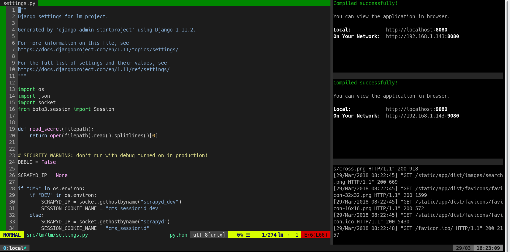

# Development

The following instructions assume that you are using a Ubuntu system, and they
have only been tested on Ubuntu 17.10. To verify that these instructions are
correct, they were tested on a VirtualBox virtual machine running a fresh
installation of Ubuntu 17.10.

## Dependencies

### Install Docker and Docker Compose
First, install Docker Community Edition. Follow the instructions
[here](https://docs.docker.com/install/linux/docker-ce/ubuntu/), or copy and
paste the commands below into a terminal.

Note that they were copied from the Docker CE installation page on 22 March
2018, and may not work the same way in the future:

```bash
sudo apt update && \
sudo apt -y install apt-transport-https ca-certificates curl software-properties-common && \
curl -fsSL https://download.docker.com/linux/ubuntu/gpg | sudo apt-key add - && \
sudo apt-key fingerprint 0EBFCD88
```

Now verify that the fingerprint (excluding spaces) is `9DC8 5822 9FC7 DD38 854A  E2D8 8D81 803C
0EBF CD88`.

Only proceed if the fingerprint matches the output of the last command (`apt-key`) above.

```bash
sudo add-apt-repository "deb [arch=amd64] https://download.docker.com/linux/ubuntu $(lsb_release -cs) stable" && \
sudo apt update && sudo apt -y install docker-ce
```

Make sure to add yourself to the `docker` group, so you can launch and manage
containers without root access:

```bash
sudo adduser $USER docker
```

Log out and log back in for this change to take effect.

Next, install Docker Compose. Follow the instructions here:
https://docs.docker.com/compose/install/

Note: make sure that you have Docker Compose version 1.20.1, build 5d8c71b
installed, not version 1.21.0, build 1719ceb, unless newer versions fix [this
issue](https://github.com/docker/compose/issues/5874).

### Install JS development dependencies and move static assets

First, install Yarn. Follow the instructions here:
https://yarnpkg.com/lang/en/docs/install/

Next, install development dependencies and use `gulp` to move static assets to
where they need to go:

```bash
sudo yarn global add gulp gulp-shell preact-cli && \
cd src/lm/app/frontend && \
yarn install && gulp build && \
cd ../../cms/frontend && \
yarn install && gulp build && \
cd ../../../../
```

## Set up your development workspace

To work on the code, set up three terminals. You may use a
[`tmux`](https://tmux.github.io/) screen with 3 panes: one for your editor, one
for `watch-app.sh`, and one for the `build_dev.sh`.

```
-----------------------------
| editor     | watch-app.sh |
|            | (App)        |
|            |--------------|
|            | watch-app.sh |
|            | (CMS)        |
|            |--------------|
|            | build_dev.sh |
|            | (App or CMS) |
-----------------------------
```

This screenshot shows the above setup in action:

<a href="./images/dev_terminal.png" target="_blank">
    
</a>

Each `watch-app.sh` script runs `preact watch` with a pre-set working directory
path and port number. Each port number is hard-coded into App and CMS Django
templates, so these scripts make it easy to run `preact watch` without having
to remember the correct port.

There are two `watch-app.sh` scripts: one for the App: 

```bash
scripts/app_server/dev/watch-app.sh
```

and another for the CMS:

```bash
scripts/admin_server/dev/watch-app.sh
```

There are two `build_dev.sh` scripts: one for the App, and another for both the
App and CMS. Each `build_dev.sh` file is a convenience script for the
`docker-compose build` and `docker-compose up` commands.

To build the App in development mode:

```bash
./scripts/app_server/dev/build_dev.sh
```

To build the CMS in development mode:
```bash
./scripts/admin_server/dev/build_dev.sh
```

On one hand, running `scripts/app_server/dev/build_dev.sh` launches the App
development containers and streams the output of the `liftedmobile_dev`
container to the standard output. On the other hand, running
`scripts/admin_server/dev/build_dev.sh` launches the App and CMS development
containers, and streams the output of the `admin_cms_dev` development container
to the standard output.


### Databases

No database configuration is needed for development as it is done
automatically. The development servers connect to databases served through the
`admin_db_dev` and `liftedmobile_db` containers. (Note: to containerise a
database is generally a bad practice in production, but is acceptable for
development purposes.)

Although the `admin_cms_dev` container is orchestrated in a different Docker
Compose file from `liftedmobile_db_dev`, it is able to connect to the Postgres
database server in `liftedmobile_db_dev`. This is made possible because
`docker/admin_server/docker-compose.dev.yml` configures Docker allow the CMS
access to the `appserver_default` internal network:

```
networks:
    default:
        external:
            name: appserver_default
```

This network name (`appserver_default`) is automatically derived from the name
of the directory (`app_server`) that contains the App Docker Compose file, with
its [underscore removed](https://github.com/docker/compose/issues/2923).

### Development server URLs

Launch the App via: http://localhost:8000

Launch the CMS via: http://localhost:9000

Default credentials for the CMS

Username: `admin`

Password: `password`

### Static assets

Static assets should be saved in `src/lm/static/<app or cms>/images` and/or
`src/lm/static/<app or cms>/favicons`. Make sure that you run `gulp build`
in the `frontend/` directory of `app` or `cms` respectively once you do so:

```bash
cd src/lm/app/frontend && gulp build
```

or

```bash
cd src/lm/cms/frontend && gulp build
```

What `gulp build` does is replace the static files which the development server
uses with those in `src/lm/static/<app or cms>/`.
