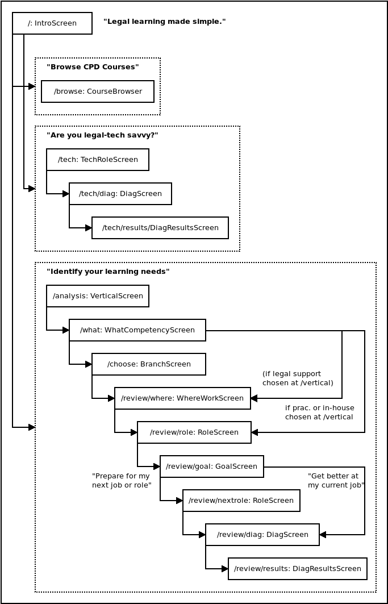

# Technical overview - Frontend

## Frontend architecture

The frontend is a Single-Page Application (SPA) built using the Preact user
interface library. It uses LESS for stylesheets, Webpack for module bundling,
Babel for ES2015 transpilation, and `preact-router` for URL routing.

<!--TODO: how to add a new route, relationship between urls.py and preact-router -->

### Architectural considerations

Preact is a user interface library mostly compatible with the more commonly
known [React](https://reactjs.org) library. It is used in this project because
Preact allows a project to have an extremely small JS module bundle size. The
App's `bundle.js` is only 158 KB (40 KB compressed), and would be several times
larger had React been used instead. Preact's compatibility with React also made
it possible to use third-party libraries built for React, such as
[`react-flatpickr`](https://www.npmjs.com/package/react-flatpickr).

Preact differs from React in ways which do not impact the successful
functioning or development of the App or CMS. These
[differences](https://preactjs.com/guide/differences-to-react), such as a lack
of synthetic events. In conjunction with its relative small bundle size, the
benefits of using Preact greatly outweigh the costs.

[`preact-cli`](https://github.com/developit/preact-cli) is used to facilitate
the complex task of combining modern Javascript development tools.  Like
[`create-react-app`](https://github.com/facebook/create-react-app), `preact-cli`
makes configuring Webpack, LESS, and Preact simple. It also provides a
development server to allow developers to work on the UI and quickly see
changes they make.

### Combining Preact, `preact-cli`, and Django

In production, the App and CMS will serve the frontend bundle via Nginx, which
is configured on both `admin_cms` and `liftedmobile` to serve static files
stored at `/src/lm/static`.

```
location /static {
   alias /src/lm/static;
   gzip_static on;
}
```

In development, however, the App and CMS will serve the CSS and JS bundles from
`0.0.0.0:8080` and `0.0.0.0:9080` respectively, which are the endpoints of
`preact watch`.  As its name suggests, `preact watch` monitors the frontend
source code and recompiles the CSS and JS bundles upon any change. This
approach allows quick updates during development, but note that it does not
support hot reloads.

The App and CMS template files, such as `src/lm/cms/templates/cms/base.html`,
selectively render the the bundle path based on the value of the template
variable `DEV`, which is supplied by a template context processor at
`src/lm/cms/context_processors.py`.

Note that there is no point accessing the URI of the `preact watch` server
(`0.0.0.0:8080` and `0.0.0.0:9080`), since the frontend code queries the
backend for data and will not render anything meaningful without said data.

### URL Routes

Since the frontend is an SPA, some URL path handling tasks must be handled by
the frontend instead of the backend, while others should only be handled by the
backend. `urls.py` in the App and CMS Django apps handle the latter, and use
this line to delegate all other routes to the frontend:

```python
url(r'^$', views.index, name=.....
```

For each URL which matches this generic URL pattern, the frontend code uses
`preact-cli` to determine what to render to the DOM. In the `render()` function
of `src/lm/app/frontend/src/components/app.js`:

```javascript
<Router onChange={this.handleRoute}>
  <IntroScreen default path="/" />
  <CourseBrowser path="/browse" /> 
  ...
</Router>
```

In the above example taken from the App, `<Router>` from `preact-router` will
render `IntroScreen` if the URL path matches `/`, and `CourseBrowser` if it
matches `/browse`, and so on.

### Components in the App

#### `Screen` and `Question` components

Apart from the `CourseBrowser` component, the App is organised as a series of
`Screen` components, as defined in
`src/lm/app/frontend/src/components/screens/`.

The `Screen` component is mean to be a parent class and each child class must
implement its own `render()` function.

Each screen is part of a chain of screens. A user will be redirected to the
next screen when they click on an option. For example, the `VerticalScreen`
asks the user which legal profession vertical they are part of. There are three
options, and when the user clicks on one, they will be redirected to the
`WhatCompetencyScreen`, and so on. The next screen in the chain is specified by
the `nextScreenPath` prop.

The options are rendered by the `Question` component. Data about each question
comes from `app.js` which fetches from the `/qns` endpoint during its
`componentDidMount()` lifecycle function. Most screens redirect to the path in
their `nextScreenPath` prop when an option gets selected, but only after saving
the selected option to the browser's LocalStorage and in the `App` component
state. 

<a href="./images/app_frontend.png" target="_blank">
    
</a>
